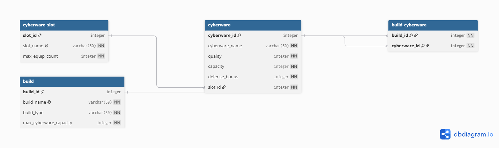

# Cyberware Build Database

Cyberpunk 2077의 사이버웨어 조합에 따른 플레이 스타일별 빌드를 관리하고 비교하기 위한 관계형 데이터베이스 실습 프로젝트입니다.

## 프로젝트 목적

사이버웨어 슬롯과 사이버웨어 정보를 저장하고, 여러 사이버웨어의 조합으로 구성된 빌드를 관리합니다. 이를 통해 빌드별 사이버웨어 구성, 총 용량, 방어력 증가량 등을 조회하고 서로 다른 플레이 스타일의 빌드를 비교할 수 있습니다.

## 개발 환경

- Database: MySQL
- SQL 실행 도구: Visual Studio Code SQL Extension
- 주제: Cyberpunk 2077 사이버웨어 빌드 관리

## 데이터베이스 구성

### 테이블

| 테이블 | 역할 |
| --- | --- |
| `cyberware_slot` | 사이버웨어 장착 슬롯과 슬롯별 최대 장착 개수 저장 |
| `cyberware` | 사이버웨어 이름, 등급, 용량, 방어력 증가량 저장 |
| `build` | 빌드 이름, 빌드 유형, 최대 사이버웨어 용량 저장 |
| `build_cyberware` | 빌드와 사이버웨어의 조합을 연결하는 중간 테이블 |

### 관계

```text
cyberware_slot 1 ─── N cyberware
build          1 ─── N build_cyberware N ─── 1 cyberware
```

`build`와 `cyberware`는 직접 연결하지 않고 `build_cyberware`를 통해 다대다 관계로 관리합니다. 하나의 빌드는 여러 사이버웨어를 포함할 수 있고, 하나의 사이버웨어는 여러 빌드에서 사용될 수 있습니다.

## 주요 설계 및 제약조건

- 네 개의 테이블 모두 기본키를 가집니다.
- 자동 증가 정수형 기본키를 사용합니다.
- `cyberware_slot.slot_name`과 `build.build_name`은 중복을 허용하지 않습니다.
- `cyberware`는 `cyberware_name`과 `quality`의 조합이 중복되지 않도록 설정했습니다.
- 사이버웨어 등급은 1부터 5까지만 허용합니다.
- 사이버웨어 용량과 방어력 증가량은 0 이상만 허용합니다.
- 슬롯별 최대 장착 개수는 1 이상만 허용합니다.
- 외래키를 통해 존재하지 않는 슬롯, 빌드, 사이버웨어를 참조하지 못하도록 설정했습니다.
- `build_cyberware`의 복합 기본키를 통해 동일한 빌드에 동일한 사이버웨어가 중복 연결되는 것을 방지합니다.

## 파일 구성

```text
sql/
├── 01_schema.sql       # 테이블 생성 및 제약조건
├── 02_sample_data.sql  # 샘플 데이터 입력
├── 03_queries.sql      # 핵심 쿼리 Q1~Q15
├── 04_bonus_queries.sql # 보너스 과제 1: JOIN과 서브쿼리 비교
├── 05_bonus_fk_test.sql # 보너스 과제 2: 외래키 오류 및 해결
└── 06_bonus_report.sql  # 보너스 과제 3: 핵심 지표 조회

results/
├── Q1.txt ~ Q15.txt    # 쿼리 실행 결과 텍스트

cyberware_build_db_ERD.png  # ERD 다이어그램
```

## 실행 방법

### 1. 데이터베이스 선택

데이터베이스를 생성한 뒤 선택합니다.

```sql
CREATE DATABASE IF NOT EXISTS cyberware_build_db;
USE cyberware_build_db;
```

이미 데이터베이스를 생성했다면 `USE`문만 실행하면 됩니다.

### 2. SQL 파일 실행 순서

다음 순서대로 실행합니다.

1. `sql/01_schema.sql`
2. `sql/02_sample_data.sql`
3. `sql/03_queries.sql`

부모 테이블인 `cyberware_slot`과 `build`에 필요한 데이터가 먼저 존재해야 외래키를 사용하는 샘플 데이터를 정상적으로 입력할 수 있습니다.

## 샘플 데이터

샘플 데이터 스크립트를 처음 실행했을 때의 행 수는 다음과 같습니다.

| 테이블 | 행 수 |
| --- | ---: |
| `cyberware_slot` | 10 |
| `cyberware` | 51 |
| `build` | 10 |
| `build_cyberware` | 60 |

각 테이블에 10행 이상의 샘플 데이터를 입력하여 과제의 데이터 조건을 충족합니다. Q14를 실행하면 어떤 빌드에도 연결되지 않은 `투사체 발사 시스템`이 삭제되므로, 실행 후 `cyberware`의 행 수는 50개가 됩니다.

## 핵심 쿼리

`sql/03_queries.sql`에는 총 15개의 핵심 쿼리가 포함되어 있습니다.

| 구분 | 문제 번호 | 내용 |
| --- | --- | --- |
| 기본 조회 | Q1~Q4 | `WHERE`, `LIKE`, `ORDER BY`를 이용한 조건 검색 |
| JOIN | Q5~Q8 | 슬롯, 빌드, 사이버웨어 간의 관련 데이터 조회 |
| 집계 | Q9~Q11 | `COUNT`, `AVG`, `GROUP BY`를 이용한 통계 조회 |
| 서브쿼리 | Q12 | 전체 평균 용량과 개별 사이버웨어 용량 비교 |
| 수정 및 삭제 | Q13~Q14 | 사이버웨어 정보 수정 및 미연결 데이터 삭제 |
| 인덱스 | Q15 | `quality`, `capacity` 복합 인덱스 생성 |

Q13과 Q14는 데이터가 실제로 변경되는 쿼리이므로 샘플 데이터를 입력한 뒤 한 번만 실행하는 것이 좋습니다. 각 쿼리의 실행 결과는 `results` 폴더에 텍스트 파일로 정리했습니다.

## 인덱스

사이버웨어의 등급과 용량을 조건으로 검색하는 조회의 효율을 높이기 위해 다음 복합 인덱스를 생성합니다.

```sql
CREATE INDEX cyberware_spec_margin
ON cyberware(quality, capacity);
```

## 보너스 과제

### 보너스 과제 1: JOIN과 서브쿼리 비교

`외피 시스템` 슬롯의 사이버웨어를 조회하는 같은 요구사항을 JOIN 방식과 서브쿼리 방식으로 각각 작성했습니다.

- 파일: `sql/04_bonus_queries.sql`
- 비교 내용: 테이블을 직접 연결하는 JOIN 방식과 슬롯 ID를 먼저 조회하는 서브쿼리 방식

### 보너스 과제 2: 외래키 오류 및 해결

존재하지 않는 `slot_id`를 입력하여 외래키 오류를 의도적으로 발생시키고, 올바른 슬롯을 참조하는 INSERT문으로 수정했습니다. 이후 사이버웨어와 슬롯이 정상적으로 연결되었는지도 확인하도록 구성했습니다.

- 파일: `sql/05_bonus_fk_test.sql`
- 확인 내용: 외래키 오류 원인, 수정된 INSERT문, 정상 입력 결과

### 보너스 과제 3: 핵심 지표 미니 리포트

빌드 관리 목적에 맞춰 다음 세 가지 핵심 지표를 SQL로 작성했습니다.

1. 빌드별 사용 사이버웨어 용량과 잔여 용량
2. 슬롯별 사이버웨어 종류와 평균 용량
3. 빌드별 총 방어력 증가량

- 파일: `sql/06_bonus_report.sql`
- 집계 함수: `COUNT`, `SUM`, `AVG`
- 활용 문법: `LEFT JOIN`, `GROUP BY`, `ORDER BY`

보너스 과제의 실행 결과도 `results` 폴더에 별도로 정리했습니다.

## ERD



## 제출물 체크리스트

- [x] 스키마 생성 SQL
- [x] 샘플 데이터 입력 SQL
- [x] 네 개의 관계형 테이블
- [x] PK, FK, UNIQUE, CHECK 제약조건
- [x] 핵심 쿼리 Q1~Q15
- [x] 쿼리 실행 결과 텍스트
- [x] ERD 이미지
- [x] 보너스 과제 1: JOIN과 서브쿼리 비교
- [x] 보너스 과제 2: 외래키 오류 및 해결
- [x] 보너스 과제 3: 핵심 지표 미니 리포트
